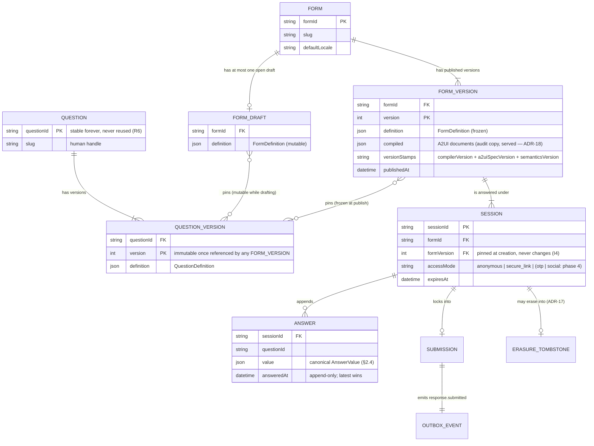
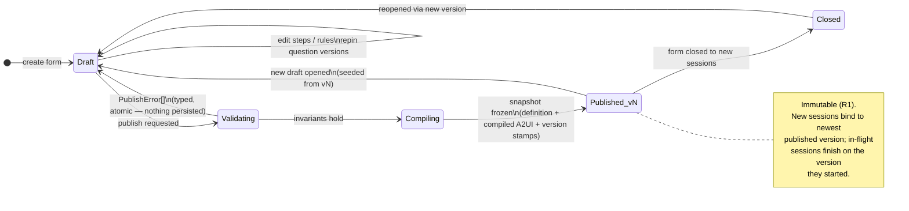
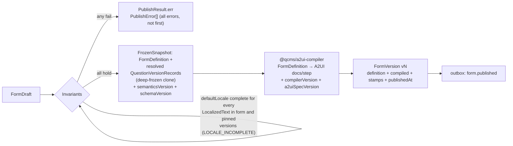
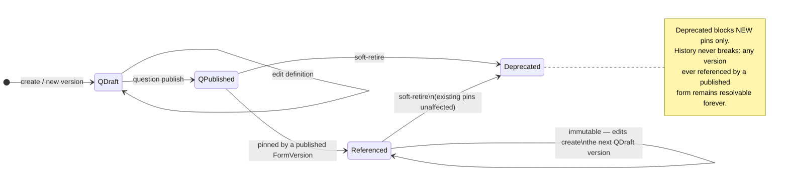

# Question CMS — Domain Schema Design

**Status:** v1.2 · supersedes Draft v1 · companion to `ARCHITECTURE.md` §3–4 and `IMPLEMENTATION_PLAN.md` Stages 1–3
**Changes from v1:** evaluation semantics rewritten per **ADR-16** (forward pass replaces fixpoint); `ChoiceOption` declaration order fixed; `VisibilityRule` semantics comment cleaned; §2.4 canonical `AnswerValue` encodings added (resolving the open item, finalized by task 002); nesting depth cap resolved (8); `show`-targets question resolved (forward-only); invariants I10–I11 added (ADR-16/17).
**Changes from v1.1 (ADR-21, 2026-07-19):** canonical value equality defined per type (§2.4 — multiChoice is set equality); `contains`/`containsAny` operators added (§3); erasure shown from any session state (§4.3).
**Changes from v1.2 (task 003, 2026-07-19):** §2.2 safe `pattern` subset finalized (implemented in `@qcms/core` `safe-pattern.ts`); cross-field refinements and their typed error codes listed; `QuestionVersionRecord` shape added to §4.2.
**Owner package:** `@qcms/core` (all types are Zod schemas; TypeScript types are inferred, never hand-written)

This document defines the domain model — the layer that governs *meaning*. Nothing here knows about A2UI, HTTP, or Postgres. Storage shapes live in `@qcms/db`; rendered shapes live in `@qcms/a2ui-compiler`; both derive from this model and never feed back into it.

---

## 1. Entity map



Two relationships carry the whole audit story: a **session pins a form version at creation** and never migrates, and **answers are append-only** with current-state defined as latest-per-`questionId`. Everything else is derivable. (ADR-17 amends append-only with exactly one exception: whole-session erasure, which deletes and tombstones — there is still no UPDATE path anywhere.)

## 2. Core value types

### 2.1 Localized text (ADR-11)

Every human-readable field is a locale map. Launch UX writes and reads only the form's `defaultLocale`; the shape makes languages a feature, not a migration.

```ts
const LocalizedText = z.record(LocaleCode, z.string());
// { "en": "Date of birth" }  — publish validates completeness for defaultLocale only
```

### 2.2 Question definitions

`questionId` is identity; `version` is content. The type union is closed per core release; adding a type is a versioned core change (never `ALTER TABLE`, per ARCHITECTURE §3). Note `ChoiceOption` is declared **before** the union that references it (v1 had the order reversed — a TDZ error if transcribed literally).

```ts
const ChoiceOption = z.object({
  optionId: OptionId,              // stable within the question; rules reference these
  label: LocalizedText,
});

const QuestionBase = z.object({
  questionId: QuestionId,          // stable forever; never reused for a different meaning (R6)
  label: LocalizedText,
  help: LocalizedText.optional(),
  required: z.boolean().default(false),
});

const QuestionDefinition = z.discriminatedUnion("type", [
  QuestionBase.extend({ type: z.literal("shortText"),
    constraints: z.object({ minLength: z.number().int().optional(),
                            maxLength: z.number().int().optional(),
                            pattern: z.string().optional() }).prefault({}) }),
  QuestionBase.extend({ type: z.literal("longText"),
    constraints: z.object({ maxLength: z.number().int().optional() }).prefault({}) }),
  QuestionBase.extend({ type: z.literal("number"),
    constraints: z.object({ min: z.number().optional(), max: z.number().optional(),
                            integer: z.boolean().default(false) }).prefault({}) }),
  QuestionBase.extend({ type: z.literal("date"),
    constraints: z.object({ min: ISODate.optional(), max: ISODate.optional() }).prefault({}) }),
  QuestionBase.extend({ type: z.literal("boolean") }),
  QuestionBase.extend({ type: z.literal("singleChoice"),
    options: z.array(ChoiceOption).min(1) }),
  QuestionBase.extend({ type: z.literal("multiChoice"),
    options: z.array(ChoiceOption).min(1),
    constraints: z.object({ minSelected: z.number().int().optional(),
                            maxSelected: z.number().int().optional() }).prefault({}) }),
]);
```

Constraints objects use `.prefault({})` (Zod 4: `.default` returns its value verbatim, `.prefault` parses it so inner defaults like `integer: false` apply).

**Cross-field refinements (task 003).** Parsing reports *all* violations, each as a typed error with code and path: `minLength ≤ maxLength` (`MIN_LENGTH_ABOVE_MAX_LENGTH`) · `min ≤ max` for number and date (`MIN_ABOVE_MAX`) · `minSelected ≤ maxSelected ≤ options.length`, incl. the transitive `minSelected ≤ options.length` when `maxSelected` is absent (`MIN_SELECTED_ABOVE_MAX_SELECTED`, `MAX_SELECTED_ABOVE_OPTION_COUNT`, `MIN_SELECTED_ABOVE_OPTION_COUNT`) · unique `optionId`s within a question — across questions they may repeat, `optionId` is question-scoped (`DUPLICATE_OPTION_ID`) · option labels non-empty for at least one locale (`OPTION_LABEL_EMPTY`) · pattern safety below (`PATTERN_INVALID`, `PATTERN_UNSUPPORTED`). Structural failures carry `INVALID_QUESTION_DEFINITION`.

**Safe `pattern` subset (task 003, implemented in `@qcms/core` `safe-pattern.ts`).** qcms bundles no RE2; patterns run on the JavaScript backtracking engine when answers are validated (task 009), so definitions accept only a subset that cannot backtrack catastrophically. Compilability is validated at parse under the `u` flag (`PATTERN_INVALID` if it does not compile). Within the subset (`PATTERN_UNSUPPORTED` otherwise):

- **Supported:** literals and escaped metacharacters; `.`; anchors `^` `$` and `\b` `\B`; character classes `[...]`/`[^...]` with ranges; class escapes `\d \D \w \W \s \S`; unicode escapes `\uXXXX`/`\u{...}` and properties `\p{...}`/`\P{...}`; alternation `|`; groups `(...)`, `(?:...)`, `(?<name>...)`; quantifiers `* + ? {n} {n,} {n,m}` (greedy or lazy).
- **Rejected:** backreferences (`\1`…`\9`, `\k<name>`) and lookahead/lookbehind assertions (the constructs RE2 excludes); unbounded quantifiers (`*`, `+`, `{n,}`) applied to a group whose body contains a quantifier or an alternation (the `(a+)+` / `(a|ab)*` shapes — bounded repetition of such groups is capped at `{..32}`); finite quantifier bounds above 1000; patterns longer than 256 characters.

The composite-group rules are deliberately conservative: some rejected patterns are harmless, but every accepted pattern is linear-time-safe on a backtracking engine.

### 2.3 Form definition

A form is ordered steps of pinned question references plus visibility rules. Pins are `{questionId, version}` pairs — the question-level versioning of ADR-02 with launch-minimal UX (manual pinning).

```ts
const QuestionRef = z.object({
  questionId: QuestionId,
  version: z.number().int().positive(),   // pinned; drafts may float, snapshots never do
});

const Step = z.object({
  stepId: StepId,
  title: LocalizedText,
  items: z.array(QuestionRef).min(1),
});

const FormDefinition = z.object({
  formId: FormId,
  defaultLocale: LocaleCode,
  title: LocalizedText,
  steps: z.array(Step).min(1),
  rules: z.array(VisibilityRule),         // §3
});
```

### 2.4 Canonical AnswerValue encodings

Decided at design time because they freeze into snapshots, ledger rows, exports, and rule comparisons. **Implemented by task 002 in `@qcms/core` (`answer-value.ts`); this is the contract:**

| Question type | Canonical encoding |
|---|---|
| `shortText` / `longText` | NFC-normalized string (normalized on parse, not rejected) |
| `number` | finite IEEE double; `integer` is a validation constraint, not an encoding |
| `date` | timezone-less ISO `YYYY-MM-DD`, validated as a real calendar date; no time, no offset — respondent-local by design; ordering is lexicographic (correct for this encoding) |
| `boolean` | JSON boolean |
| `singleChoice` | `OptionId` |
| `multiChoice` | `OptionId[]`, deduplicated, order-preserving |

`Comparable` (for `gt/gte/lt/lte`) = number \| date string; cross-type comparison is a typed error and unreachable post-publish (rule type-checking, §3).

**Value equality (ADR-21).** `equals`/`notEquals`/`in` compare canonical encodings: strict equality for scalars (strings after NFC normalization; numbers by IEEE-double equality — authoring guidance warns against `equals` on non-integer number questions), and **set equality** for `multiChoice` arrays (order- and duplicate-insensitive; the canonical encoding is already deduplicated). `in` is membership by this same equality. Containment *within* a multiChoice answer is expressed with `contains`/`containsAny` (§3), never with `equals`. Implemented and exported as `valuesEqual` (task 002).

**Ordered comparison (task 002).** `compareValues(a, b)` implements the DSL's `gt/gte/lt/lte` over `Comparable`: numbers compare numerically; dates compare **lexicographically on the canonical `YYYY-MM-DD` encoding**, which is equivalent to calendar order for this fixed-width form. Number-vs-date returns a typed `COMPARE_TYPE_MISMATCH` error; any operand outside `Comparable` (boolean, array, non-date string, non-finite number) returns `NOT_COMPARABLE`. Both are unreachable post-publish (rule type-checking) but defined, typed, and never thrown.

**Parse surface (task 002).** Each encoding exports a Zod schema (source of truth; types via `z.infer`) plus a `parseX` helper returning a typed `Result` — `INVALID_TEXT_ANSWER`, `INVALID_NUMBER_ANSWER`, `INVALID_DATE_ANSWER`, `INVALID_BOOLEAN_ANSWER`, `INVALID_SINGLE_CHOICE_ANSWER`, `INVALID_MULTI_CHOICE_ANSWER`, `INVALID_ANSWER_VALUE` (union), `INVALID_COMPARABLE`. Parsing normalizes rather than rejects where the contract says so: text is NFC-normalized on parse; multiChoice arrays are deduplicated preserving first-occurrence order. Error messages never echo answer values (SECURITY_DESIGN: answer values are never logged).

## 3. Rules DSL (ADR-03, semantics per ADR-16)

A closed, typed condition language. Closed is the feature: it makes publish-time validation against pinned question versions possible, keeps evaluation deterministic and auditable, and lets a visual builder emit the format later. Nesting depth is capped at **8**, publish-validated.

```ts
const Condition: z.ZodType<Condition> = z.lazy(() => z.discriminatedUnion("op", [
  z.object({ op: z.literal("equals"),    questionId: QuestionId, value: AnswerValue }),
  z.object({ op: z.literal("notEquals"), questionId: QuestionId, value: AnswerValue }),
  z.object({ op: z.literal("in"),        questionId: QuestionId, values: z.array(AnswerValue).min(1) }),
  z.object({ op: z.literal("gt"),  questionId: QuestionId, value: Comparable }),
  z.object({ op: z.literal("gte"), questionId: QuestionId, value: Comparable }),
  z.object({ op: z.literal("lt"),  questionId: QuestionId, value: Comparable }),
  z.object({ op: z.literal("lte"), questionId: QuestionId, value: Comparable }),
  z.object({ op: z.literal("answered"), questionId: QuestionId }),
  z.object({ op: z.literal("contains"),    questionId: QuestionId, value: OptionId }),                 // multiChoice only (ADR-21)
  z.object({ op: z.literal("containsAny"), questionId: QuestionId, values: z.array(OptionId).min(1) }), // multiChoice only (ADR-21)
  z.object({ op: z.literal("and"), conditions: z.array(Condition).min(1) }),
  z.object({ op: z.literal("or"),  conditions: z.array(Condition).min(1) }),
  z.object({ op: z.literal("not"), condition: Condition }),
]));

const VisibilityRule = z.object({
  ruleId: RuleId,
  when: Condition,
  show: z.array(z.union([QuestionId, StepId])).min(1),
});
```

**Containment operators (ADR-21):** `contains` is true when the multiChoice answer includes the given `optionId`; `containsAny` when it includes at least one listed `optionId`. Both are type-valid only against `multiChoice` questions — publish rejects other uses (`RULE_TYPE_MISMATCH`). `equals` on multiChoice is whole-answer **set equality** (§2.4), not containment.

**Visibility semantics:** targets listed in *any* rule are **conditional** — hidden by default, shown when at least one targeting rule matches. Items never targeted by a rule are unconditionally visible. A `StepId` target expands to all its questions.

**Implementation (task 005, `@qcms/core`).** `Condition`/`VisibilityRule` are exported with typed parse helpers; the depth cap (`CONDITION_MAX_DEPTH = 8`) is validated at parse with `RULE_DEPTH_EXCEEDED`, and `parseFormDefinition` validates every rule entry in place. The publish-time graph machinery lives alongside as pure functions over a `FormDefinition`: `documentOrder`, `ruleReferences`, `ruleTargets` (a `StepId` target expands to the step's questions), `analyzeRuleGraph` (typed `RULE_BACKWARD_TARGET`/`RULE_CYCLE` findings, invariant I10), and `checkRuleTypes(form, resolveQuestion)` (typed `RULE_TYPE_MISMATCH`/`DANGLING_OPTION_REF` findings; the injected lookup keeps the kernel I/O-free, R3). `compileDraft` (008) runs them at publish; the admin editor (033) runs them live.

**Evaluation semantics (ADR-16, frozen with each snapshot as `semanticsVersion = 1`):**

1. Evaluation is a **single forward pass in document order** — not a fixpoint. This is well-defined because publish rejects any rule whose targets do not appear strictly *after* every question its condition references (`RULE_BACKWARD_TARGET`) and any cycle in the reads→shows graph (`RULE_CYCLE`).
2. Conditions over unanswered questions are `false`, except `answered`, which is the explicit existence test. This includes `notEquals`: an unanswered question does not satisfy `notEquals` — the condition is `false`, not `true`.
3. Answers of questions evaluated as *hidden* are excluded from all subsequent condition evaluation and from the locked submission — well-defined because a referenced question's visibility was settled earlier in the walk.
4. Same `(snapshot, answers)` → same `FlowState`, forever. Changing these numbered semantics requires a new `semanticsVersion`; old snapshots evaluate under their recorded version.

*(v1 of this document described evaluation as a "pure fixpoint"; that formulation was unsound under hidden-answer exclusion — visibility could oscillate with no unique fixpoint. ADR-16 records the analysis and decision.)*

**Evaluator (task 006, `@qcms/core` `evaluate-rules.ts`).** `SEMANTICS_VERSION = 1` is exported and stamped into snapshots by `compileDraft` (008). The implemented signature is:

```ts
evaluateRules(
  snapshot: FrozenSnapshot | FormDefinition,
  answers: AnswerMap,                     // ReadonlyMap<QuestionId, AnswerValue> — current answers,
                                          // latest-per-question resolution happens in storage (I5)
  resolveQuestion: ResolveQuestion,       // questionId → pinned QuestionDefinition
): Result<FlowState, EvalError>
```

`resolveQuestion` is the same injected-lookup pattern as `checkRuleTypes` (005): `required` lives on `QuestionDefinition`, not on the form, and the kernel stays I/O-free (R3) — the caller owns loading the pinned versions. It must be a pure lookup; determinism (I7) is over `(snapshot, answers, resolved definitions)`.

```ts
const FlowState = z.object({
  visible: z.array(z.object({ stepId: StepId, questionId: QuestionId })), // document order
  visibleSteps: z.array(StepId),   // steps contributing ≥1 visible question (derived from `visible`;
                                   // a step whose questions are all rule-hidden renders nothing and is not listed)
  currentStep: StepId.nullable(),  // semantic: first visible step with a visible unanswered *required*
                                   // question, else first with any visible unanswered question, else null
  answeredRequired: z.array(QuestionId), // visible required questions with an answer, document order
  missingRequired: z.array(QuestionId),  // visible required questions without one, document order
  complete: z.boolean(),                 // missingRequired is empty (I9's precondition; the sweep is 009)
});
```

Step-level and question-level targeting are separate layers that **AND** together: a `StepId` in a rule's `show` conditions the *step* (settled at step entry; a hidden step contributes no visible questions regardless of per-question rules), a `QuestionId` conditions only that question (settled at its document position, within a visible step). A question is answered iff the answer map has an entry for it; `answered` is therefore true for falsy answers (`false`, `""`, `[]`).

Totality: the evaluator never throws. Malformed input returns a typed `EvalError` — `INVALID_FORM_DEFINITION`, `UNSUPPORTED_SEMANTICS_VERSION` (a snapshot recording a version this evaluator does not implement), `UNRESOLVED_QUESTION_PIN`, `MALFORMED_ANSWER_VALUE`, `CONDITION_TYPE_MISMATCH` (an operator over incompatible runtime types) — every one unreachable on publish-validated input, and none ever echoes an answer value. Deterministic extensions for unvalidated input: a reference whose visibility is not yet settled at the point of evaluation (backward/self reference, or an id not pinned in the form) reads as unanswered; answer-map keys not pinned in the form are ignored.

## 4. Lifecycles

### 4.1 Form: draft → publish (the aggregate, ADR-01/02/14/16)



The `Validating → Compiling → Published` path is one atomic core call, `compileDraft(draft)`:



**Implementation (task 008, `@qcms/core` `compile-draft.ts`).** The implemented signature is `compileDraft(draft: DraftInput): PublishResult` with `DraftInput = { definition: FormDefinition, resolveQuestion: (questionId, version) => QuestionVersionRecord | undefined, publishedQuestionVersions: ReadonlyMap<QuestionId, ReadonlySet<number>> }` — the caller supplies both lookups; core never does I/O (R3). On success the `FrozenSnapshot` carries the definition plus the resolved `QuestionVersionRecord` per pin (document order), deep-frozen as a clone (the caller's draft stays editable), stamped `{ semanticsVersion: SEMANTICS_VERSION, schemaVersion: SNAPSHOT_SCHEMA_VERSION }`. Compiled A2UI and its stamps are attached by the API slice using 011's compiler (nodes D/F above are 011/013/022) — core does not import the compiler. Parse-level refinements (duplicate step/question pins, the condition depth cap) are re-checked with structured domain paths, so a hand-built definition still yields a complete publish report.

### 4.2 Question versions

The stored shape per version (task 003) — `questionId` is identity, `version` is content; immutability of published versions is enforced by storage + publish (tasks 013/021), not by the schema:

```ts
const QuestionVersionRecord = z.object({
  questionId: QuestionId,
  version: z.number().int().positive(),
  definition: QuestionDefinition,        // §2.2
});
```



Launch cut-line (R7): no auto-upgrade, no impact analysis — a draft's pin moves only when the author moves it. The cascade UX arrives in Phase 4 without touching this model.

### 4.3 Session and answers (ADR-07, ADR-17)

```mermaid
stateDiagram-v2
    direction LR
    [*] --> Created : start-session\n(anonymous | secure_link)\npins formVersion
    Created --> InProgress : first answer appended
    InProgress --> InProgress : answer appended\n(insert-only; latest-per-questionId wins)\nrules re-evaluated → FlowState
    InProgress --> Submitted : submit\nvalidate all · lock answer set
    Submitted --> [*]
    Created --> Expired : retention sweep
    InProgress --> Expired : retention sweep
    InProgress --> Erased : ADR-17 erasure\n(any state may erase)
    Submitted --> Erased : ADR-17 erasure\n(delete + tombstone)
    note right of Submitted
        Lock = the audit boundary:
        the answer ledger up to lock
        is the complete history of
        what changed and when.
        Emits response.submitted
        via outbox (at-least-once).
    end note
```

## 5. Invariants → owning core function

| # | Invariant | Enforced by | Task |
|---|---|---|---|
| I1 | Published `FormVersion` and referenced `QuestionVersion`s are immutable | `compileDraft` freeze + no mutating API + DB rejection | 008, 013 |
| I2 | Every rule reference resolves against pinned question versions (incl. `optionId`s, types) | `compileDraft` validation | 008 |
| I3 | `defaultLocale` complete for all `LocalizedText` in the snapshot | `compileDraft` validation | 008 |
| I4 | Sessions pin a version at creation; never migrate | session creation; absent update path | 014, 018 |
| I5 | Answers are append-only; current = latest per `questionId` (sole exception: whole-session erasure, ADR-17) | ledger schema; no UPDATE path; scoped erasure door | 013, 016 |
| I6 | Hidden answers excluded from evaluation and from the locked submission | `evaluateRules` + submit lock | 006, 009 |
| I7 | Same `(snapshot, answers)` → same `FlowState`, forever | forward-pass purity; `semanticsVersion` stamped per snapshot | 006, 008 |
| I8 | `questionId` / `optionId` never reused with a different meaning | authoring API refusal + R6 review rule | 021 |
| I9 | Submission validates every visible required answer before lock | `prepareSubmission` sweep | 009, 020 |
| I10 | Rule graph is forward-only and acyclic in every published snapshot (ADR-16) | `analyzeRuleGraph` in `compileDraft` | 005, 008 |
| I11 | Erasure removes content, preserves existence (tombstone), excludes from reporting (ADR-17) | `eraseSession` transaction | 016 |

## 6. Worked example

A fragment of the insurance fixture: smokers get a follow-up.

```json
{
  "formId": "frm_life_signup",
  "defaultLocale": "en",
  "title": { "en": "Life insurance sign-up" },
  "steps": [{
    "stepId": "stp_health",
    "title": { "en": "Health" },
    "items": [
      { "questionId": "q_smoker",     "version": 2 },
      { "questionId": "q_cigs_daily", "version": 1 }
    ]
  }],
  "rules": [{
    "ruleId": "rul_smoker_followup",
    "when": { "op": "equals", "questionId": "q_smoker", "value": true },
    "show": ["q_cigs_daily"]
  }]
}
```

The rule is valid under ADR-16: its target (`q_cigs_daily`) appears after its referenced question (`q_smoker`) in document order. Publish freezes this with `q_smoker@2` / `q_cigs_daily@1`, compiles the step's A2UI document, and stores both with version stamps. Both questions are `required` in their pinned definitions.

Evaluating (task 006) as answers arrive — `evaluateRules(snapshot, answers, resolveQuestion)`:

| answers (latest per question) | visible | currentStep | missingRequired | complete |
|---|---|---|---|---|
| `{}` | `q_smoker` | `stp_health` | `q_smoker` | `false` |
| `q_smoker=true` | `q_smoker`, `q_cigs_daily` | `stp_health` | `q_cigs_daily` | `false` |
| `q_smoker=true, q_cigs_daily=20` | `q_smoker`, `q_cigs_daily` | `null` | — | `true` |
| `q_smoker=false, q_cigs_daily=20` (stale) | `q_smoker` | `null` | — | `true` |

The last row is hidden-answer exclusion (I6) at work: a session answering `q_smoker=true`, then `q_cigs_daily=20`, then `q_smoker=false` leaves three ledger rows; the forward pass sees the latest per question, hides `q_cigs_daily`, excludes its stale `20` from every later condition, and does not count it against completeness. The eventual submission excludes the orphaned answer from the locked set — while the ledger still shows it was once given, which is the audit property working as designed.

---

## Resolution of v1 open items

| v1 open item | Resolution |
|---|---|
| Canonical `AnswerValue` encoding (esp. dates/timezones) | §2.4, finalized by task 002 — decided before the evaluator exists |
| May `show` target future steps only, or any step? | Forward-only, publish-enforced (ADR-16, I10) |
| Max nesting depth for `Condition` | 8, publish-validated (`RULE_DEPTH_EXCEEDED`) |
